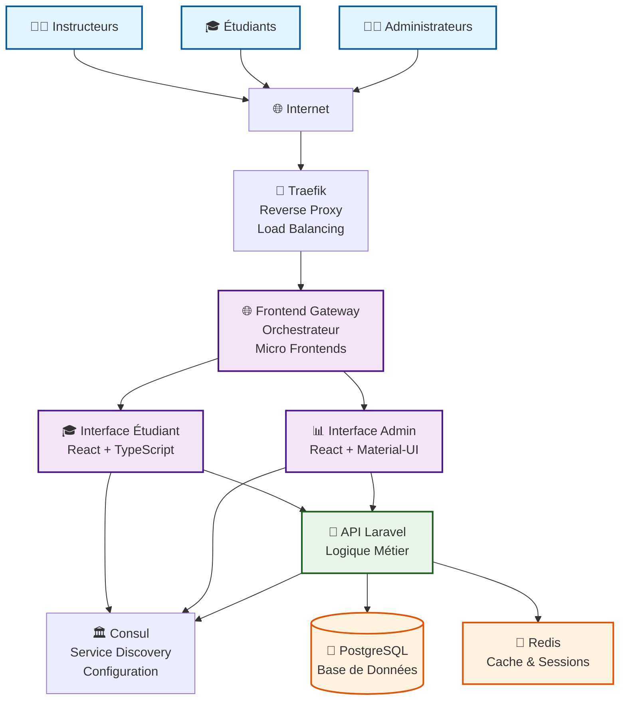
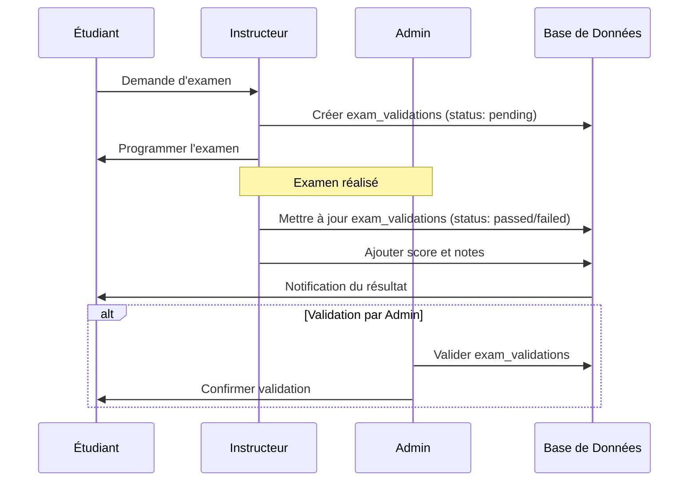

# 🚗 DGTT Auto-École - Architecture

## Vue d'Ensemble

Système de gestion d'auto-école basé sur une architecture de microservices avec validation manuelle des examens.

## 🏗️ Architecture des Microservices



## 🎯 Composants Principaux

### **Frontend Microservices:**
- **🌐 Frontend Gateway** - Orchestrateur des micro frontends
- **📊 Interface Admin** - Tableau de bord de gestion
- **🎓 Interface Étudiant** - Portail étudiant

### **Backend Services:**
- **🔧 API Laravel** - Logique métier et API REST
- **🏛️ Consul** - Découverte de services et configuration

### **Couche Données:**
- **🐘 PostgreSQL** - Base de données principale
- **🔴 Redis** - Cache et gestion des sessions

### **Infrastructure:**
- **🚦 Traefik** - Reverse proxy et équilibrage de charge
- **🐳 Docker** - Conteneurisation

## 🗄️ Schéma de Base de Données

### **Tables Principales:**

```sql
-- Utilisateurs (admins, instructeurs, étudiants)
users (id, name, email, password, user_type, status)

-- Auto-écoles
auto_ecoles (id, name, address, phone, email, license_number)

-- Instructeurs
instructors (id, user_id, auto_ecole_id, license_number, specialization, experience_years)

-- Étudiants
students (id, user_id, auto_ecole_id, student_number, license_type, status, total_hours)

-- Véhicules
vehicles (id, auto_ecole_id, make, model, year, license_plate, vehicle_type, status)

-- Sessions de formation
training_sessions (id, student_id, instructor_id, vehicle_id, session_type, session_date, status)

-- Cours
lessons (id, auto_ecole_id, instructor_id, title, description, lesson_type, duration_hours)

-- Inscriptions aux cours
lesson_enrollments (id, lesson_id, student_id, enrollment_date, status)

-- Validation d'examens (MANUEL)
exam_validations (id, student_id, validator_id, exam_type, validation_date, status, score, notes)

-- Notifications
notifications (id, user_id, title, message, type, is_read)

-- Messages
messages (id, sender_id, receiver_id, subject, message, is_read)
```

## 🔄 Flux de Validation d'Examens



## 🚀 Déploiement

### **Développement Local:**
```bash
# Démarrer tous les services
docker-compose up -d

# Vérifier Consul
open http://localhost:8500

# Vérifier les services
docker-compose ps
```

### **URLs de Développement:**
- **Interface Principale**: http://dgtt.local
- **Interface Admin**: http://admin.dgtt.local
- **Interface Étudiant**: http://student.dgtt.local
- **API Backend**: http://api.dgtt.local
- **Consul UI**: http://localhost:8500

## 🔧 Configuration Consul

Consul est configuré en mode single-node pour le développement:

```yaml
consul:
  image: consul:1.17
  command: agent -server -bootstrap-expect=1 -ui -node=server-1 -bind=0.0.0.0 -client=0.0.0.0
  ports:
    - "8500:8500"
    - "8600:8600/udp"
  environment:
    - CONSUL_LOCAL_CONFIG={"datacenter":"dc1","server":true,"bootstrap_expect":1,"ui_config":{"enabled":true}}
```

## 📊 Avantages de cette Architecture

1. **✅ Validation Manuelle** - Processus simple et flexible
2. **🏗️ Microservices** - Déploiement indépendant
3. **🔍 Service Discovery** - Consul pour la découverte automatique
4. **⚡ Performance** - Redis pour le cache
5. **🔒 Sécurité** - Validation par utilisateurs autorisés
6. **📈 Scalabilité** - Architecture horizontale
7. **🎯 Conforme DGTT** - Adapté aux besoins des auto-écoles françaises

## 🔍 Monitoring

- **Consul UI** - Santé des services
- **Traefik Dashboard** - Métriques de routage
- **Logs Docker** - Surveillance des applications
- **Health Checks** - Vérification automatique

Cette architecture fournit une solution robuste et évolutive pour la gestion d'auto-écoles avec validation manuelle des examens.