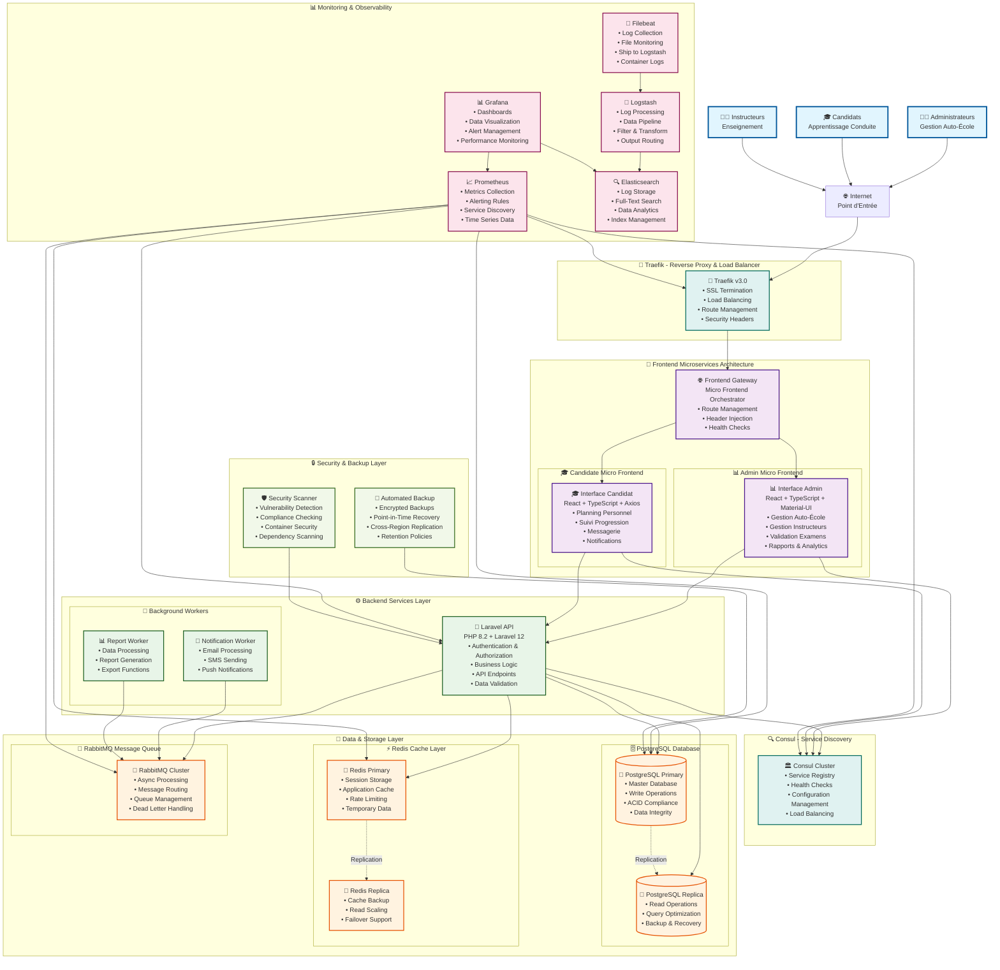

# 🏗️ Architecture Technique DGTT Auto-École

## Vue d'Ensemble de l'Architecture



## 🔄 Flux de Données Principaux

### **1. Authentification Utilisateur**
```
Utilisateur → Internet → Traefik → Frontend Gateway → Micro Frontend → API Laravel → PostgreSQL
```

### **2. Planification de Cours**
```
Admin → Interface Admin → API Laravel → PostgreSQL → RabbitMQ → Worker → Notification → Candidat
```

### **3. Validation d'Examen (Manuelle)**
```
Instructeur → Interface Admin → API Laravel → PostgreSQL → Notification → Candidat
```

### **4. Traitement Asynchrone**
```
Événement → RabbitMQ → Worker → Email/SMS/Export → Utilisateur Final
```

## 🎯 Composants Clés

### **Frontend Microservices**
- **Architecture Modulaire**: Déploiement indépendant de chaque micro frontend
- **Gateway Pattern**: Routage intelligent vers les micro frontends appropriés
- **Technology Stack**: React + TypeScript + Material-UI + Axios

### **Backend API**
- **Framework**: Laravel 12 avec PHP 8.2
- **Authentication**: Sanctum pour l'authentification API
- **Validation**: Validation manuelle des examens par admins/instructeurs
- **Queues**: Traitement asynchrone avec RabbitMQ

### **Infrastructure**
- **Service Discovery**: Consul pour la découverte automatique des services
- **Load Balancing**: Traefik pour l'équilibrage de charge et SSL
- **Message Queue**: RabbitMQ pour le traitement asynchrone
- **Caching**: Redis pour les sessions et le cache applicatif

### **Base de Données**
- **Primary**: PostgreSQL avec réplication pour la haute disponibilité
- **Cache**: Redis avec réplication pour la scalabilité
- **Schema**: Optimisé pour les besoins DGTT avec validation manuelle

### **Monitoring & Observabilité**
- **Métriques**: Prometheus pour la collecte de métriques
- **Visualisation**: Grafana pour les tableaux de bord
- **Logs**: ELK Stack pour l'agrégation et l'analyse des logs
- **Alertes**: Alertes automatiques en cas de problème

## 🔒 Sécurité & Conformité

### **Authentification & Autorisation**
- **Multi-Rôles**: Admin, Instructeur, Candidat avec permissions granulaires
- **API Security**: Tokens sécurisés avec Laravel Sanctum
- **Session Management**: Sessions chiffrées avec Redis

### **Protection des Données**
- **Chiffrement**: Données sensibles chiffrées au repos et en transit
- **Validation**: Validation côté serveur et client
- **Audit Trail**: Traçabilité complète des actions utilisateur

### **Infrastructure Sécurisée**
- **Container Security**: Images Docker sécurisées et mises à jour
- **Network Isolation**: Isolation réseau avec Docker
- **SSL/TLS**: Certificats automatiques avec Let's Encrypt

## 📈 Scalabilité & Performance

### **Horizontal Scaling**
- **Micro Frontends**: Scaling indépendant de chaque frontend
- **API Load Balancing**: Répartition de charge avec Traefik
- **Database Replication**: Réplicas de lecture pour PostgreSQL et Redis

### **Optimisation des Performances**
- **Caching Strategy**: Cache Redis multi-niveaux
- **CDN Ready**: Configuration prête pour CDN
- **Database Optimization**: Index optimisés et requêtes performantes

### **Haute Disponibilité**
- **Health Checks**: Vérification automatique de la santé des services
- **Failover**: Basculement automatique en cas de panne
- **Backup Strategy**: Sauvegardes automatisées et chiffrées

Cette architecture fournit une base solide, scalable et sécurisée pour la gestion d'auto-écoles DGTT avec validation manuelle des examens et traitement asynchrone des notifications.
