# 📁 Structure du Projet DGTT Auto-École

## Vue d'Ensemble Visuelle

```mermaid
graph TD
    %% Root Project
    Root[r-dgtt/ 🚗 DGTT Auto-École]
    
    %% Frontend Microservices
    subgraph "🎨 Frontend Microservices"
        Gateway[frontend-gateway/<br/>🌐 Gateway Orchestrator<br/>Nginx Configuration]
        Admin[frontend-admin/<br/>📊 Interface Admin<br/>React + TypeScript + Material-UI]
        Candidate[frontend-candidate/<br/>🎓 Interface Candidat<br/>React + TypeScript + Axios]
    end
    
    %% Backend Services
    subgraph "⚙️ Backend Services"
        Backend[backend/<br/>🔧 API Laravel<br/>PHP 8.2 + Laravel 12<br/>Business Logic + Authentication]
    end
    
    %% Infrastructure Configuration
    subgraph "🏗️ Infrastructure Configuration"
        Consul[consul/<br/>🔍 Service Discovery<br/>config.json + services/]
        Traefik[traefik/<br/>🚦 Reverse Proxy<br/>traefik.yml + dynamic.yml + rules/]
        RabbitMQ[rabbitmq/<br/>🐰 Message Queue<br/>rabbitmq.conf + definitions.json]
    end
    
    %% Database
    subgraph "🗄️ Database"
        Database[database/<br/>📊 PostgreSQL Schema<br/>init/ + migrations + seeders]
    end
    
    %% Docker & Orchestration
    subgraph "🐳 Docker & Orchestration"
        Docker[docker-compose.yml<br/>🐳 Container Orchestration<br/>All Services Configuration]
        Make[Makefile<br/>⚡ Development Commands<br/>start, stop, build, deploy]
    end
    
    %% Documentation
    subgraph "📚 Documentation"
        README[README.md<br/>📖 Main Documentation<br/>Complete French Guide]
        ARCH[ARCHITECTURE.md<br/>🏗️ Technical Architecture<br/>System Design Details]
        PROJ[PROJECT_STRUCTURE.md<br/>📁 Project Organization<br/>File Structure Guide]
        IGNORE[.gitignore<br/>🚫 Git Ignore Rules<br/>Excluded Files]
    end
    
    %% Security
    subgraph "🔒 Security"
        Security[security/<br/>🛡️ Security Policies<br/>Vulnerability Scanning]
    end
    
    %% Monitoring (Optional)
    subgraph "📊 Monitoring (Optional)"
        Monitor[monitoring/<br/>📈 Observability<br/>Prometheus + Grafana + ELK]
    end
    
    %% Connections
    Root --> Gateway
    Root --> Admin
    Root --> Candidate
    Root --> Backend
    Root --> Consul
    Root --> Traefik
    Root --> RabbitMQ
    Root --> Database
    Root --> Docker
    Root --> Make
    Root --> README
    Root --> ARCH
    Root --> PROJ
    Root --> IGNORE
    Root --> Security
    Root --> Monitor
    
    %% Styling
    classDef frontendClass fill:#e3f2fd,stroke:#1976d2,stroke-width:2px
    classDef backendClass fill:#e8f5e8,stroke:#388e3c,stroke-width:2px
    classDef infraClass fill:#fff3e0,stroke:#f57c00,stroke-width:2px
    classDef dataClass fill:#fce4ec,stroke:#c2185b,stroke-width:2px
    classDef dockerClass fill:#e0f2f1,stroke:#00695c,stroke-width:2px
    classDef docClass fill:#f3e5f5,stroke:#7b1fa2,stroke-width:2px
    classDef securityClass fill:#ffebee,stroke:#d32f2f,stroke-width:2px
    classDef monitorClass fill:#e1f5fe,stroke:#0277bd,stroke-width:2px
    
    class Gateway,Admin,Candidate frontendClass
    class Backend backendClass
    class Consul,Traefik,RabbitMQ infraClass
    class Database dataClass
    class Docker,Make dockerClass
    class README,ARCH,PROJ,IGNORE docClass
    class Security securityClass
    class Monitor monitorClass
```



## 📋 Détail des Composants

### **🎨 Frontend Microservices**
- **frontend-gateway/**: Orchestrateur des micro frontends avec Nginx
- **frontend-admin/**: Interface administrateur avec React + Material-UI
- **frontend-candidate/**: Interface candidat avec React + TypeScript

### **⚙️ Backend Services**
- **backend/**: API Laravel avec logique métier et authentification

### **🏗️ Infrastructure**
- **consul/**: Configuration de découverte de services
- **traefik/**: Configuration du reverse proxy et load balancing
- **rabbitmq/**: Configuration de la file de messages

### **🗄️ Base de Données**
- **database/**: Scripts SQL pour PostgreSQL

### **🐳 Orchestration**
- **docker-compose.yml**: Configuration des conteneurs
- **Makefile**: Commandes de développement

### **📚 Documentation**
- **README.md**: Guide principal en français
- **ARCHITECTURE.md**: Architecture technique détaillée
- **PROJECT_STRUCTURE.md**: Organisation du projet

### **🔒 Sécurité**
- **security/**: Politiques de sécurité et scanning

### **📊 Monitoring**
- **monitoring/**: Observabilité avec Prometheus, Grafana, ELK

## 🚀 Points d'Entrée

### **Développement Rapide**
```bash
# Démarrage complet
make start

# Services individuels
docker-compose up consul -d
docker-compose up traefik -d
docker-compose up postgres -d
docker-compose up rabbitmq -d
docker-compose up backend -d
docker-compose up frontend-gateway -d
docker-compose up frontend-admin -d
docker-compose up frontend-candidate -d
```

### **URLs de Développement**
- **Interface Principale**: http://dgtt.local
- **Interface Admin**: http://admin.dgtt.local
- **Interface Candidat**: http://candidate.dgtt.local
- **API Backend**: http://api.dgtt.local
- **Consul UI**: http://localhost:8500
- **RabbitMQ Management**: http://localhost:15672
- **Traefik Dashboard**: http://localhost:8080

Cette structure modulaire permet un développement, déploiement et maintenance facilités de chaque composant indépendamment.
