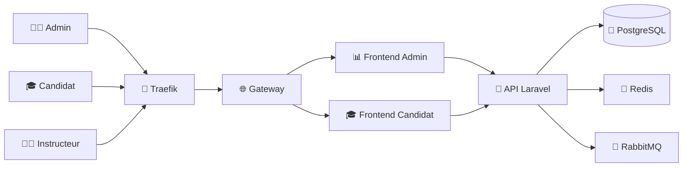
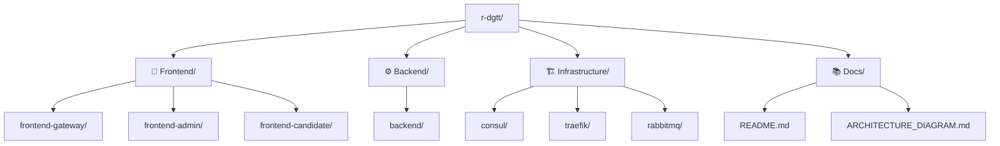

# 🚗 DGTT Auto-École - Système de Gestion

[](ARCHITECTURE_DIAGRAM.md)
[](PROJECT_STRUCTURE_DIAGRAM.md)
[](docker-compose.yml)
[](backend/)
[](frontend-admin/)

## 📋 Description

Système de gestion complet pour auto-écoles françaises, développé avec une architecture de microservices modernes utilisant Laravel, React, et des technologies de conteneurisation Docker.

### 🎯 Aperçu Visuel Rapide

<details>
<summary>🏗️ Architecture Système</summary>



</details>

<details>
<summary>📁 Structure du Projet</summary>



</details>

## 🎯 Objectif

Créer une plateforme complète de gestion d'auto-école qui respecte les exigences DGTT ( Direction generale des transports terrestre )  avec :
- Gestion des étudiants, instructeurs et véhicules
- Planification des cours et leçons
- Validation manuelle des examens
- Notifications asynchrones
- Interface moderne et responsive

## 🏗️ Architecture Technique

### **Vue d'Ensemble**
Notre système utilise une architecture de microservices avec :
- **Frontend** : Micro frontends React avec gateway
- **Backend** : API Laravel avec traitement asynchrone
- **Base de données** : PostgreSQL avec Redis pour le cache
- **Messages** : RabbitMQ pour les tâches asynchrones
- **Infrastructure** : Docker, Traefik, Consul

### **📊 Visualisations**
- **[🏗️ Architecture Technique](ARCHITECTURE_DIAGRAM.md)** - Diagramme complet de l'architecture système
- **[📁 Structure du Projet](PROJECT_STRUCTURE_DIAGRAM.md)** - Organisation visuelle des fichiers et dossiers

## 📁 Structure du Projet

```
r-dgtt/
├── backend/                    # API Laravel (PHP 8.2)
│   ├── Dockerfile             # Image Docker pour l'API
│   └── app/                   # Code source Laravel
├── frontend-admin/             # Interface Admin React
│   ├── Dockerfile             # Image Docker pour Admin
│   ├── nginx.conf             # Configuration Nginx
│   └── src/                   # Code source React
├── frontend-student/           # Interface Étudiant React
│   ├── Dockerfile             # Image Docker pour Étudiant
│   ├── nginx.conf             # Configuration Nginx
│   └── src/                   # Code source React
├── frontend-gateway/           # Gateway Micro Frontends
│   ├── Dockerfile             # Image Docker pour Gateway
│   └── nginx.conf             # Configuration de routage
├── consul/                     # Configuration Consul
│   ├── config.json            # Configuration principale
│   ├── services/              # Définitions des services
│   └── README.md              # Documentation Consul
├── traefik/                    # Configuration Traefik
│   ├── traefik.yml            # Configuration principale
│   ├── dynamic.yml            # Configuration dynamique
│   ├── rules/                 # Règles par environnement
│   └── README.md              # Documentation Traefik
├── rabbitmq/                   # Configuration RabbitMQ
│   ├── rabbitmq.conf          # Configuration principale
│   ├── definitions.json       # Queues et exchanges
│   └── README.md              # Documentation RabbitMQ
├── database/                   # Scripts de base de données
│   └── init/                  # Scripts d'initialisation
├── docker-compose.yml          # Orchestration Docker
├── Makefile                    # Commandes utiles
└── README.md                   # Ce fichier
```

## 🛠️ Technologies Utilisées

### **Frontend**
- **React 18** : Framework JavaScript moderne
- **TypeScript** : Typage statique pour la robustesse
- **Material-UI** : Composants UI modernes
- **Axios** : Client HTTP pour les API
- **Nginx** : Serveur web pour servir les applications

### **Backend**
- **Laravel 12** : Framework PHP moderne
- **PHP 8.2** : Langage de programmation backend
- **Eloquent ORM** : Mapping objet-relationnel
- **Laravel Queues** : Traitement asynchrone avec RabbitMQ

### **Base de Données**
- **PostgreSQL 15** : Base de données relationnelle principale
- **Redis 7** : Cache et stockage de sessions
- **Migrations Laravel** : Gestion des schémas de base de données

### **Infrastructure**
- **Docker & Docker Compose** : Conteneurisation et orchestration
- **Traefik v3** : Reverse proxy et équilibrage de charge
- **Consul** : Découverte de services et configuration
- **RabbitMQ** : File de messages asynchrones

## 🚀 Guide de Démarrage Étape par Étape

### **Étape 1 : Prérequis**

Assurez-vous d'avoir installé :
```bash
# Docker et Docker Compose
docker --version
docker-compose --version

# Git
git --version

# Ports disponibles
# 80, 443, 5432, 6379, 5672, 15672, 8500, 8080
```

### **Étape 2 : Configuration des Hosts Locaux**

Ajoutez ces lignes à votre fichier hosts :
```bash
# Linux/Mac : /etc/hosts
# Windows : C:\Windows\System32\drivers\etc\hosts

127.0.0.1 dgtt.local
127.0.0.1 admin.dgtt.local
127.0.0.1 candidate.dgtt.local
127.0.0.1 api.dgtt.local
127.0.0.1 traefik.dgtt.local
127.0.0.1 rabbitmq.dgtt.local
```

### **Étape 3 : Démarrage des Services**

```bash
# Cloner le projet
git clone <repository-url>
cd r-dgtt

# Démarrer tous les services
docker-compose up -d

# Vérifier le statut
docker-compose ps
```

### **Étape 4 : Initialisation de la Base de Données**

```bash
# La base de données s'initialise automatiquement
# Vérifier les logs si nécessaire
docker-compose logs postgres

# Accéder à la base de données
docker-compose exec postgres psql -U dgtt_user -d dgtt_auto_ecole
```

### **Étape 5 : Vérification des Services**

| Service | URL | Description |
|---------|-----|-------------|
| **Interface Principale** | http://dgtt.local | Gateway principal |
| **Interface Admin** | http://admin.dgtt.local | Gestion auto-école |
| **Interface Candidat** | http://candidate.dgtt.local | Portail candidat |
| **API Backend** | http://api.dgtt.local | API REST |
| **Consul UI** | http://localhost:8500 | Découverte de services |
| **RabbitMQ Management** | http://localhost:15672 | Interface de gestion des messages |
| **Traefik Dashboard** | http://localhost:8080 | Proxy et routage |

## 🔧 Configuration Détaillée

### **1. Consul - Découverte de Services**

**Rôle** : Centraliser la découverte et la configuration des services

**Configuration** :
```json
{
  "datacenter": "dc1",
  "server": true,
  "bootstrap_expect": 1,
  "ui_config": {"enabled": true}
}
```

**Services enregistrés** :
- backend-api (API Laravel)
- frontend-admin (Interface Admin)
- frontend-student (Interface Étudiant)
- frontend-gateway (Gateway)
- postgres (Base de données)
- redis (Cache)
- rabbitmq (Messages)

### **2. Traefik - Reverse Proxy**

**Rôle** : Routage intelligent et équilibrage de charge

**Configuration** :
- **Entry Points** : HTTP (80) et HTTPS (443)
- **Providers** : Docker avec détection automatique
- **Middlewares** : Sécurité, CORS, Rate Limiting
- **Routers** : Routage par domaine et path

**Sécurité** :
- Headers de sécurité (CSP, HSTS, XSS Protection)
- Rate limiting (100 req/min)
- CORS configuré
- Authentification Basic Auth

### **3. RabbitMQ - File de Messages**

**Rôle** : Traitement asynchrone des tâches

**Configuration** :
- **Port AMQP** : 5672 (communication)
- **Port Management** : 15672 (interface web)
- **VHost** : dgtt_vhost
- **Utilisateurs** : dgtt_user (admin), dgtt_worker (worker)

**Queues** :
- notifications.email (Emails de notification)
- notifications.sms (SMS de notification)
- reports.generation (Génération de rapports)
- emails.send (Envoi direct d'emails)

**Exchanges** :
- dgtt.notifications (Topic - routage par type)
- dgtt.reports (Topic - génération de rapports)
- dgtt.emails (Direct - envoi direct)

### **4. PostgreSQL - Base de Données**

**Rôle** : Stockage persistant des données

**Configuration** :
- **Version** : PostgreSQL 15
- **Base** : dgtt_auto_ecole
- **Utilisateur** : dgtt_user
- **Encodage** : UTF-8

**Tables principales** :
- users (Utilisateurs système)
- auto_ecoles (Établissements)
- instructors (Instructeurs)
- students (Étudiants)
- vehicles (Véhicules)
- training_sessions (Séances de formation)
- lessons (Cours)
- lesson_enrollments (Inscriptions)
- exam_validations (Validation manuelle des examens)
- notifications (Notifications)
- messages (Messagerie)

### **5. Redis - Cache et Sessions**

**Rôle** : Cache et stockage de sessions

**Configuration** :
- **Version** : Redis 7
- **Persistence** : AOF (Append Only File)
- **Memory** : Limite automatique

**Utilisation** :
- Cache des requêtes API
- Stockage des sessions utilisateur
- Cache des données fréquemment accédées

## 📊 Fonctionnalités Principales

### **👨‍💼 Gestion Administrative**
- **Gestion des Auto-Écoles** : Création et configuration des établissements
- **Gestion des Instructeurs** : Profils, spécialisations, disponibilités
- **Gestion des Étudiants** : Dossiers, progression, historique
- **Gestion du Parc** : Véhicules, contrôles techniques, assurances
- **Planification** : Cours, leçons, disponibilités
- **Validation d'Examens** : Validation manuelle par admin/instructeur

### **🎓 Interface Candidat**
- **Planning Personnel** : Consultation des cours programmés
- **Progression** : Suivi des heures et compétences
- **Messagerie** : Communication avec les instructeurs
- **Notifications** : Rappels et informations importantes
- **Documents** : Téléchargement des attestations

### **📚 Gestion des Cours**
- **Catalogue** : Leçons théoriques et pratiques
- **Inscription** : Réservation des créneaux
- **Présence** : Suivi de l'assiduité
- **Évaluation** : Notes et commentaires instructeurs

### **🚗 Gestion du Parc**
- **Inventaire** : Véhicules disponibles
- **Maintenance** : Contrôles techniques et réparations
- **Réservation** : Attribution des véhicules aux leçons
- **Suivi** : Kilométrage et état général

### **📝 Validation d'Examens (Manuelle)**
- **Processus Simple** : Admin/Instructeur valide manuellement
- **Types d'Examens** : Théorique, pratique, final
- **Scoring** : Score optionnel avec notes
- **Audit Trail** : Traçabilité complète des validations

## 🔄 Flux de Données

### **1. Authentification**
```
Utilisateur → Traefik → Frontend → API Laravel → PostgreSQL
```

### **2. Planification de Cours**
```
Admin → Interface Admin → API Laravel → PostgreSQL → RabbitMQ → Notifications
```

### **3. Validation d'Examen**
```
Instructeur → Interface Admin → API Laravel → PostgreSQL → Notification Étudiant
```

### **4. Notifications Asynchrones**
```
Événement → RabbitMQ → Worker → Email/SMS → Étudiant/Instructeur
```

## 🔒 Sécurité

### **Authentification et Autorisation**
- **Laravel Sanctum** : Authentification API
- **Rôles** : Admin, Instructeur, Étudiant
- **Permissions** : Granulaires par fonctionnalité

### **Protection des Données**
- **Chiffrement** : Données sensibles chiffrées
- **Validation** : Validation côté serveur et client
- **CORS** : Configuration restrictive
- **Rate Limiting** : Protection contre les abus

### **Infrastructure**
- **Headers de Sécurité** : CSP, HSTS, XSS Protection
- **HTTPS** : Certificats Let's Encrypt automatiques
- **Isolation** : Conteneurs Docker isolés
- **Backups** : Sauvegardes automatisées et chiffrées

## 📈 Monitoring et Observabilité

### **Consul**
- **Health Checks** : Surveillance de la santé des services
- **Service Discovery** : Découverte automatique
- **Configuration** : Gestion centralisée

### **Traefik**
- **Métriques** : Performance et routage
- **Logs** : Traçabilité des requêtes
- **Dashboard** : Interface de monitoring

### **RabbitMQ**
- **Management UI** : Surveillance des queues
- **Métriques** : Performance des messages
- **Alertes** : Notifications en cas de problème

### **PostgreSQL**
- **Logs** : Surveillance des requêtes
- **Performance** : Métriques de base de données
- **Backups** : Vérification des sauvegardes

## 🚀 Déploiement Production

### **Hetzner (Ubuntu)**

```bash
# 1. Préparation du serveur
sudo apt update && sudo apt upgrade -y
sudo apt install docker.io docker-compose git -y

# 2. Configuration des domaines DNS
# dgtt.fr → IP_SERVEUR
# admin.dgtt.fr → IP_SERVEUR
# student.dgtt.fr → IP_SERVEUR
# api.dgtt.fr → IP_SERVEUR

# 3. Déploiement
git clone <repository-url>
cd r-dgtt
docker-compose up -d

# 4. Configuration SSL (automatique avec Traefik)
# Les certificats Let's Encrypt sont générés automatiquement
```

### **Variables d'Environnement Production**

```bash
# Base de données
DB_HOST=postgres
DB_DATABASE=dgtt_auto_ecole
DB_USERNAME=dgtt_user
DB_PASSWORD=CHANGER_EN_PRODUCTION

# Redis
REDIS_HOST=redis
REDIS_PORT=6379

# RabbitMQ
RABBITMQ_HOST=rabbitmq
RABBITMQ_PORT=5672
RABBITMQ_USER=dgtt_user
RABBITMQ_PASSWORD=CHANGER_EN_PRODUCTION

# Consul
CONSUL_HOST=consul
CONSUL_PORT=8500

# Application
APP_ENV=production
APP_DEBUG=false
```

## 🛠️ Commandes Utiles

```bash
# Démarrage
make start                    # Démarrer tous les services
make stop                     # Arrêter tous les services
make restart                  # Redémarrer tous les services

# Développement
make logs                     # Voir les logs de tous les services
make logs-backend             # Logs du backend uniquement
make build                    # Reconstruire les images

# Base de données
make db-init                  # Initialiser la base de données
make db-seed                  # Insérer les données de test
make db-backup                # Sauvegarder la base de données

# Monitoring
make monitor-status           # Statut de tous les services
make monitor-grafana          # Ouvrir Grafana
make monitor-prometheus       # Ouvrir Prometheus

# Maintenance
make clean                    # Nettoyer les conteneurs et volumes
make security-scan            # Scanner les vulnérabilités
```

## 🔧 Développement

### **Structure des Microservices**

**Backend (Laravel)** :
```
backend/
├── app/
│   ├── Http/Controllers/     # Contrôleurs API
│   ├── Models/              # Modèles Eloquent
│   ├── Jobs/                # Tâches asynchrones
│   ├── Services/            # Logique métier
│   └── Events/              # Événements système
├── database/
│   ├── migrations/          # Migrations de base de données
│   └── seeders/             # Données de test
└── tests/                   # Tests unitaires et fonctionnels
```

**Frontend Admin (React)** :
```
frontend-admin/
├── src/
│   ├── components/          # Composants réutilisables
│   ├── pages/               # Pages de l'application
│   ├── services/            # Services API
│   ├── hooks/               # Hooks personnalisés
│   └── types/               # Types TypeScript
└── public/                  # Assets statiques
```

**Frontend Student (React)** :
```
frontend-student/
├── src/
│   ├── components/          # Composants réutilisables
│   ├── pages/               # Pages étudiant
│   ├── services/            # Services API
│   └── utils/               # Utilitaires
└── public/                  # Assets statiques
```

### **API Endpoints**

**Authentification** :
```
POST /api/auth/login          # Connexion
POST /api/auth/logout         # Déconnexion
GET  /api/auth/user          # Profil utilisateur
```

**Gestion Étudiants** :
```
GET    /api/students         # Liste des étudiants
POST   /api/students         # Créer un étudiant
GET    /api/students/{id}    # Détails d'un étudiant
PUT    /api/students/{id}    # Modifier un étudiant
DELETE /api/students/{id}    # Supprimer un étudiant
```

**Gestion Cours** :
```
GET    /api/lessons          # Liste des cours
POST   /api/lessons          # Créer un cours
GET    /api/lessons/{id}     # Détails d'un cours
PUT    /api/lessons/{id}     # Modifier un cours
```

**Validation d'Examens** :
```
GET    /api/exam-validations         # Liste des validations
POST   /api/exam-validations         # Créer une validation
PUT    /api/exam-validations/{id}    # Valider un examen
```

## 🤝 Contribution

1. **Fork** le projet
2. **Créer** une branche feature (`git checkout -b feature/nouvelle-fonctionnalite`)
3. **Commit** les changements (`git commit -am 'Ajout nouvelle fonctionnalité'`)
4. **Push** vers la branche (`git push origin feature/nouvelle-fonctionnalite`)
5. **Créer** une Pull Request

### **Standards de Code**
- **PHP** : PSR-12 pour Laravel
- **JavaScript** : ESLint + Prettier
- **TypeScript** : Configuration stricte
- **Tests** : Coverage minimum 80%

## 📝 Licence

Ce projet est sous licence MIT. Voir le fichier `LICENSE` pour plus de détails.

## 📞 Support

Pour toute question ou problème :
- **Issues GitHub** : Créer une issue pour les bugs
- **Documentation** : Consulter les README des modules
- **Logs** : `docker-compose logs [service]` pour diagnostiquer
- **Monitoring** : Utiliser les interfaces de monitoring

---

**🚗 DGTT Auto-École** - Solution moderne et complète pour la gestion d'auto-écoles au Gabon